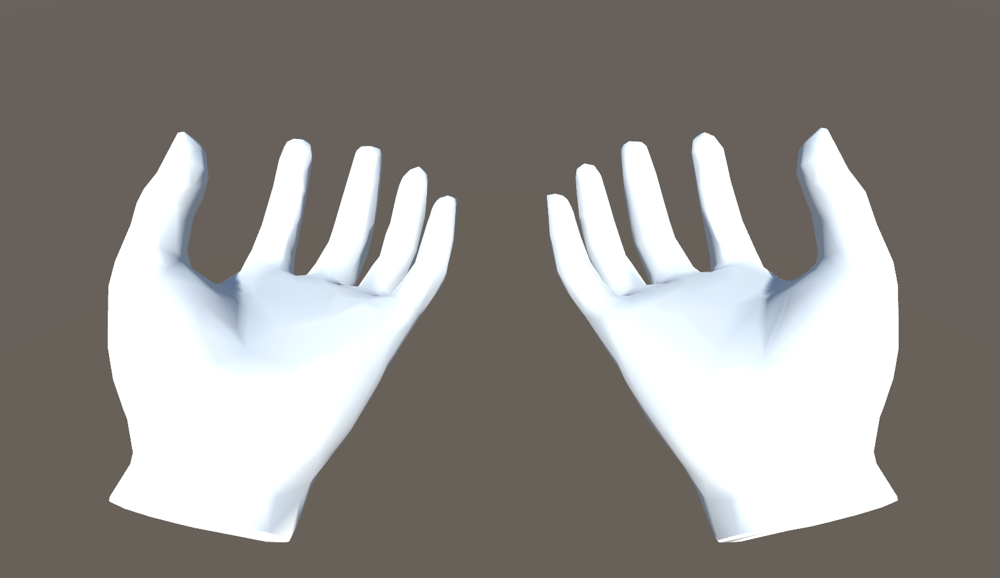

# lslsub_handModel

This project is a 3D hands model able to listen and do movement according to two LSL streams commanding the fingers position.

# Usage
## Run
In the release directory execute the program lslsub_handModel.exe

## LSL Streams
Two LSL streams are created: "Right_Hand" & "Left_Hand". The current hand configurations are puplished in those streams.
To send configuration command you should create an float LSL stream called "Left_Hand_Command" or "Right_Hand_Command" and send 15 floats long vectors reprensenting the joints of each finger.  

# Credits
This project was programmed on Unity IDE. Using [LSL4Unity plugin](https://github.com/xfleckx/LSL4Unity) of xfleckx, some modifications where done on "AInlet" class to enable online connection and disconnection when the lsl streams are found or lost.
The Hand model are the one of [Oculus Rift](https://developer.oculus.com/downloads/package/oculus-hand-models/).